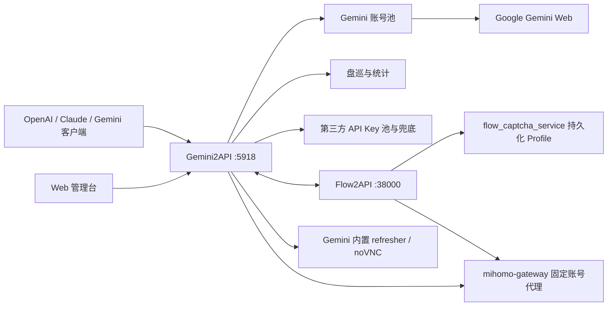

# Gemini2API 项目总览与修改日志

> 最后更新：2026-08-12
>
> 适用仓库：`752801828/gemini2api`
>
> Flow 配套仓库：`N1Moo/flow2api` 的 `codex/gemini-cookie-bridge` 分支

## 1. 文档用途

本文档是当前定制版本的统一维护入口，记录项目职责、部署结构、主要功能、关键接口、数据文件、失败恢复策略、Flow 联动约束和定制修改日志。

维护要求：以后凡是修改代码、配置、接口、页面、数据结构、容器或部署方式，都必须在同一次提交中更新本文档的“修改日志”。纯格式化且不改变行为的修改也应留下简短记录。

## 2. 项目定位

Gemini2API 使用 Google Gemini Web 登录 Cookie 提供兼容 API，把一个或多个 Gemini 网页账号封装为统一服务，主要解决：

- 同时兼容 OpenAI、Claude、Gemini 和 OpenAI Responses 协议。
- 多账号轮询、并发控制、失败切号、Cookie 更新和账号健康维护。
- 支持文本、图文、多模态上传、图片生成、流式响应和 Gemini Gem。
- 提供 Web 管理台、盘巡中心、实时日志、用量统计、API Key 池和模型映射。
- 与 Flow2API 连接，从 Flow 的持久化浏览器 Profile 获取 Gemini Cookie。
- 对 Flow 同步账号保持 Cookie 获取出口与 Gemini 后续请求出口一致。

本项目是基于网页协议的研究型反向代理，不是 Google 官方 API。Cookie、账号和代理均属于敏感信息。

## 3. 总体架构



### 3.1 容器职责

| 容器 | 默认端口 | 职责 |
|---|---:|---|
| `gemini2api` | `5918` | API、账号池、管理台、盘巡、Flow bridge、日志和统计 |
| `gemini2api-refresher` | 内部 `6080`，本机 `6081` | 手工账号的按账号 Chromium Profile、Cookie 获取和 noVNC |
| `flow2api` | `38000` | Flow 账号、代理、浏览器 Profile 与 Gemini Cookie 导出 |
| `flow2api-mihomo` | 内部动态端口 | Flow 账号固定代理出口，同时供 Gemini 同步账号使用 |
| `flow-captcha-service` | `8060/8061` | Flow 持久化浏览器 Profile、登录、ST/CK 获取 |

`gemini2api`、`flow2api` 和 `flow2api-mihomo` 必须加入外部 Docker 网络 `gemini-bridge`。

## 4. 功能总览

### 4.1 协议与接口兼容

- OpenAI Chat Completions：模型列表、非流式、SSE 流式、工具调用、图文输入。
- OpenAI Responses：文本、流式事件、工具调用和第三方转发。
- OpenAI Images：图片生成并返回 Base64 或本地图片地址。
- Claude Messages：消息、流式响应、工具调用和 Token 估算。
- Gemini 原生：`generateContent`、`streamGenerateContent`、`inlineData`、`fileData`。
- Deep Research：发起、流式和交互式研究任务。
- 标准裸路径与带协议前缀路径同时可用。

### 4.2 模型与 Gem

- 对外稳定模型名：`gemini-pro`、`gemini-flash`、`gemini-flash-thinking`、`gemini-flash-lite`。
- 启动时按账号网页真实能力解析内部模型，不把账号之间的模型映射混用。
- 支持模型别名与管理台模型映射。
- 支持 Gemini 自定义 Gem 的查询、新建、修改、删除。
- 可把 Gem 映射为对外模型名，并固定使用 Gem 所属账号。
- 支持网页端扩展思考/扩展模式的模型路由。

### 4.3 多账号池与请求失败策略

- 支持 `accounts.json` 多账号持久化。
- 支持 round-robin 和 failover 两种选择策略。
- 每账号独立并发计数；首选账号繁忙时直接选择其他空闲账号。
- 网络或 5xx 失败先在同账号快速重试一次，再切换不同账号。
- 单请求最多尝试 3 个不同账号。
- 5xx/429 进入短期 cooldown，不直接永久禁用账号。
- 401/403、Cookie 失效或客户端未就绪会触发 Cookie 恢复。
- 空内容会重试，不把 HTTP 200 空响应当成成功。
- 流式请求只有在首字节发送前允许无感切换，避免重复输出。

### 4.4 Cookie 与浏览器维护

- Cookie 持久化到磁盘，服务重启后继续使用最新值。
- `RotateCookies` 自动更新 `__Secure-1PSIDTS`。
- 清理容易造成重定向循环的辅助 Cookie，并处理同名 `NID` 域冲突。
- 手工账号可使用内置 Chromium Profile/noVNC 登录和续期。
- 每个账号使用独立 Profile，避免登录态串号。
- 账号管理显示 CK 更新时间、具体 Cookie、Flow 邮箱和维护状态。
- 首页已移除独立浏览器中心和扫码进群/赞助入口。

### 4.5 Flow 账号同步

- 管理台可读取 Flow 账号列表并选择同步账号。
- 已同步账号默认勾选，取消勾选可停止该账号同步。
- 同步过程显示进度，后台并发上限为 4。
- Flow 业务启用/禁用状态与 Gemini 账号状态隔离；Flow 禁用不阻止使用其浏览器 Profile 维护 CK。
- CK 获取失败等待 2–5 秒重试，最多 3 次，全部失败后才发送飞书维护告警。
- 同步回调必须包含 Flow Token ID、代理节点、原始代理端点和路由指纹。
- Gemini 先切换到 Flow 固定代理，再验证并保存 Cookie。
- Flow 账号没有代理信息时不得直连初始化，会等待重新同步。
- 普通请求、流式请求、文件上传、Cookie 轮换和客户端初始化都使用该账号的 Flow 代理。
- 路由指纹与 Flow 返回不一致时拒绝本轮同步，避免 CK 与出口错配。

### 4.6 图文、多模态与图片生成

- OpenAI、Claude、Gemini 三种请求格式均可携带图片。
- 支持 Data URL、文件上传和多张参考图。
- 上传会话固定在选中的账号客户端和代理上。
- 图文盘巡从用户上传图片池随机选图，允许配置每次图片数量并允许重复抽取。
- 图片生成结果可保存到本地并通过受控 URL 返回。
- 支持自然语言生图意图识别，过滤网页内部占位 URL。

### 4.7 盘巡中心

- 文字测试和图文测试可独立启用、独立配置测试次数。
- 支持自定义执行周期和手动立即执行一轮。
- 文字测试从多套固定模板中随机提问。
- 图文测试随机选择用户上传图片，并使用随机描述类问题，不调用生图。
- 测试模型支持多选，每个子任务随机选择模型。
- 子任务失败支持重试，记录完整错误、响应、耗时和账号。
- 轮次记录可展开到任务，再展开具体任务详情。
- 支持删除整轮任务、批量选择并删除轮次。
- 显示文字/图文成功率、各模块平均耗时、整轮耗时。
- 按账号、模型统计调用量、成功数、失败数和成功率。
- 统计今日任务、本轮任务、历史任务。
- 实时日志包含盘巡请求，任务响应不再截断。
- 每轮完成后通过飞书 Webhook 通知；Flow/浏览器 CK 维护失败也会通知。

### 4.8 API Key 池与第三方兜底

- 管理第三方 API Key、标签、状态、模型目录和导入导出。
- 支持相同模型多提供商故障切换和冷却。
- Gemini 请求失败或空响应时可按配置切换第三方模型。
- 支持 OpenAI `reasoning_effort` 与 Anthropic thinking 参数映射。
- API Key、Cookie、代理密码在日志和管理响应中脱敏。

### 4.9 管理台、日志与统计

- 仪表盘：服务状态、账号状态、请求量、错误量和模型数。
- 账号管理：新增、删除、检测、Cookie 编辑、CK 更新时间、Flow 邮箱、同步代理节点和来源。
- 模型测试/API Playground：直接生成完整请求示例并测试接口；同一测试能力已整合到 Flow2API 的双服务调试台。
- Gem 管理、模型映射、API Key 管理、设置管理。
- 实时日志：状态、账号、模型、耗时、错误摘要，以及同一条业务 API 记录的请求与返回详情；自动脱敏密钥、移除 Base64 媒体并限制正文大小，管理接口不保存正文。
- 用量统计：快照、历史趋势和按天/小时汇总。
- 网页会话自动清理，支持保留周期和跳过置顶会话。

## 5. 主要 API 分组

| 分组 | 主要路径 | 说明 |
|---|---|---|
| OpenAI | `/v1/models`、`/v1/chat/completions`、`/v1/responses`、`/v1/images/generations` | OpenAI 兼容调用 |
| Claude | `/v1/messages`、`/v1/messages/count_tokens` | Anthropic 兼容调用 |
| Gemini | `/v1beta/models/*:generateContent`、`*:streamGenerateContent` | Gemini 原生格式 |
| Research | `/gemini/v1beta/deepresearch*` | 深度研究 |
| Accounts | `/admin/accounts*`、`/admin/reload-cookies` | 账号、Cookie、检测、浏览器维护 |
| Flow bridge | `/admin/flow-bridge/*`、`/internal/flow-bridge/*` | Flow 列表、同步、回调和健康检查 |
| Patrol | `/admin/patrol*` | 盘巡配置、轮次、图片、删除和统计 |
| API keys | `/admin/api-keys*` | 第三方 Key 池与模型目录 |
| Gems | `/admin/gems*`、`/admin/gem-mapping*` | Gem 与模型映射 |
| Logs/usage | `/admin/logs*`、`/admin/usage-stats*` | 日志与使用统计 |
| System | `/health`、`/admin/settings`、`/admin/restart` | 健康、配置和运维 |

完整字段以各协议文档和 FastAPI 路由实现为准。

## 6. 数据与配置

| 路径/配置 | 内容 | 备份要求 |
|---|---|---|
| `.env` | API Key、桥接密钥、刷新/并发/超时配置 | 必须备份，不提交 Git |
| `accounts.json` | 账号 Cookie、Flow 映射、固定代理与路由指纹 | 必须备份，包含敏感凭据 |
| `data/cookies/` | 持久化 Cookie jar | 建议备份 |
| `data/browser_profiles/` | 内置浏览器账号 Profile | 登录态重要时备份 |
| `data/patrol/` | 盘巡配置、轮次、任务、图片和统计 | 需要保留历史时备份 |
| `data/` 其他文件 | 日志快照、指纹、模型与映射状态 | 建议整体备份 |

不要把 `.env`、`accounts.json`、Cookie、代理密码、飞书签名或 Webhook 写入本文档和 Git。

## 7. 部署与更新

### 7.1 服务机目录

- Gemini：`D:\gemini2api`
- Flow：`D:\flow2api`

### 7.2 共享网络

```bat
docker network inspect gemini-bridge >nul 2>&1 || docker network create gemini-bridge
```

网络中至少应包含：`gemini2api`、`flow2api`、`flow2api-mihomo`。

### 7.3 健康检查

```bat
curl http://localhost:5918/health
docker compose ps
docker compose logs --tail=100 gemini2api
```

## 8. 关键安全与一致性约束

1. Flow 同步账号的 CK 获取和 Gemini 请求必须使用同一固定代理路由。
2. 没有代理、节点 ID 或有效路由指纹的 Flow Cookie 回调必须拒绝。
3. 账号固定代理地址不得通过普通管理 API 明文返回。
4. Flow 业务禁用不能级联禁用 Gemini；Cookie/路由失败只能影响对应账号。
5. 切号重试不得复用失败账号的上传会话、Cookie jar 或代理客户端。
6. `accounts.json` 和 Cookie 文件必须原子写入，避免断电导致账号全部丢失。
7. 飞书 Webhook、签名、Cookie、API Key 和代理密码不得写入日志或 Git。

## 9. 当前故障策略

```text
账号 A
  ├─ 网络/5xx/超时 → 同账号快速重试 1 次
  ├─ 仍失败且未输出响应 → 触发 CK 恢复并尝试账号 B
  ├─ 账号 B 失败 → 尝试账号 C
  └─ 最多 3 个不同账号 → 返回聚合失败
```

- 首选账号忙：不等待固定槽位，直接使用其他空闲账号。
- Flow CK 获取：2–5 秒随机等待，最多 3 次，最终失败才告警。
- 空内容：按失败处理并重试。
- 5xx/429：账号短期冷却，不永久禁用。
- Cookie/路由不匹配：拒绝使用，防止账号出口漂移。

## 10. 测试基线

2026-08-12 基线：`241 passed, 1 xfailed`。已知 xfail 为生图意图短语边界误判，不影响实时日志或 Flow 代理一致性。

每次修改至少运行与变更相关的测试；涉及账号池、桥接、代理、请求链路或数据结构时应运行完整测试集。

## 11. 定制修改日志

### 2026-08-12

- 修复盘巡任务在可用账号少于账号总数时按全部账号放大并发的问题；现在按“活跃账号数 × 单账号并发上限”限制整轮并发，超出容量的子任务在盘巡调度层等待，不再进入账号池后触发 `All accounts busy`。不改变对外 API 的账号轮换与失败切换策略；部署需重建 Gemini2API 容器。验证：新增活跃容量并发回归测试。

- 实时日志详情增加业务 API 请求和返回内容；非流式 JSON 保存结构化响应，流式响应保存最多 64 KiB 安全预览，客户端收到的响应字节保持不变。
- 日志正文自动脱敏 API Key、Bearer Token、Cookie 等敏感字段，Base64 图片/音频/视频只记录省略标记；单字段和整段日志均限制长度，避免图文请求撑大 `data/logs.json`。
- 管理接口继续只记录路径、状态和耗时，不保存后台账号、Cookie 或配置响应。部署后需重建 `gemini2api` 容器并强制刷新管理页面。

### 2026-08-11

- Gemini 测试能力整合到 Flow2API API Playground，并同步两端默认 API Key 配置与网页预填值。
- 账号管理卡片展示 Flow 同步代理的节点名称、节点 ID 和同步状态；原始代理 URL 不在前端暴露。
- `fb68fd3`：Flow 同步账号保存固定代理节点、代理端点和路由指纹；客户端初始化、普通/流式请求、上传和 Cookie 轮换统一走该代理；未同步代理的 Flow 账号禁止直连。
- 文档基线：新增项目总览、功能清单、部署约束和持续维护规则。

### 2026-08-10

- `9d66f4a`：首选账号繁忙、过期或冷却时直接使用其他空闲账号。
- `13c0d54`：Flow CK 获取失败等待 2–5 秒重试，最多 3 次后告警。
- `d5584c5`：改进 Flow 账号选择同步、同步进度和盘巡并发加载。
- `be18c00`：增加盘巡按账号/模型统计、成功率和实时请求日志。
- `b4e5630`：已有 Flow 同步账号默认勾选。
- `12ad5b6`：新增可选择账号的 Flow 同步管理流程。
- `4b33e74`：修复盘巡多图上传和图文请求稳定性。

### 2026-08-08

- `c80fb1d`：盘巡轮次支持多选批量删除。

### 2026-08-06

- `ba4d89e`：细化 Flow CK 恢复、维护告警和盘巡控制。
- `b2f10f7`：完善 Gemini 模型模式、监控和模型显示。
- `e966d17`：新增美化后的 API 请求 Playground。
- `53ccb73`：请求切号前尝试刷新 Gemini Cookie。
- `95983e1`：Gemini 容器加入共享 `gemini-bridge` 网络。
- `5332105`：修复 Windows 文件进入 Linux 容器时的入口脚本换行问题。

### 2026-08-05

- `6c85558`：浏览器镜像构建改为非交互，避免时区选择卡住。
- `47f9021`：Compose 改为从当前仓库构建部署镜像。
- `de89f05`：Flow Cookie 刷新最终失败发送飞书通知。
- `b3a6691`：接入 Flow Cookie bridge，并对 Gemini 空响应增加重试。
- `309e84f`：加入 Flow 风格 noVNC 账号浏览器。
- `0db6a3a`：账号浏览器交互登录和盘巡成功率。
- `f267344`：新增浏览器维护中心（后续入口按需求移除）。
- `2743755`：每个 Gemini 账号绑定独立浏览器 Profile。

### 2026-08-04

- `1231cfa`：完整展示盘巡任务输入、响应、错误和图片信息。
- `db8a80b`：修复 Cookie 刷新重定向循环。
- `7c06784`：轮次/任务双层展开、横向布局和独立测试次数。
- `cf6b072`：文字模板随机、图文描述随机、图片池和模型多选随机。
- `ace30b5`：账号持久化与管理台缓存更新。
- `112790a`：新增定时盘巡、文字/图文测试、统计和飞书通知。

### 2026-07-30

- `3a0b46e`：对外增加 `gemini-flash-lite`。
- `1a6b545`、`63c1590`、`31a0d69`：版本号及多语言 API/使用文档同步。

更早的上游版本变更保留在根目录 `CHANGELOG.md` 和 Git 历史中。

## 12. 后续修改日志模板

```markdown
### YYYY-MM-DD

- `<commit>`：修改类型（功能/修复/配置/部署/文档）；影响模块；用户可见行为；迁移或兼容说明；验证结果。
```

提交前检查：

- 功能清单是否需要更新。
- API、配置、数据文件或部署命令是否变化。
- 失败策略、安全约束或 Flow/Gemini 路由是否变化。
- 修改日志是否记录日期、影响和测试结果。
